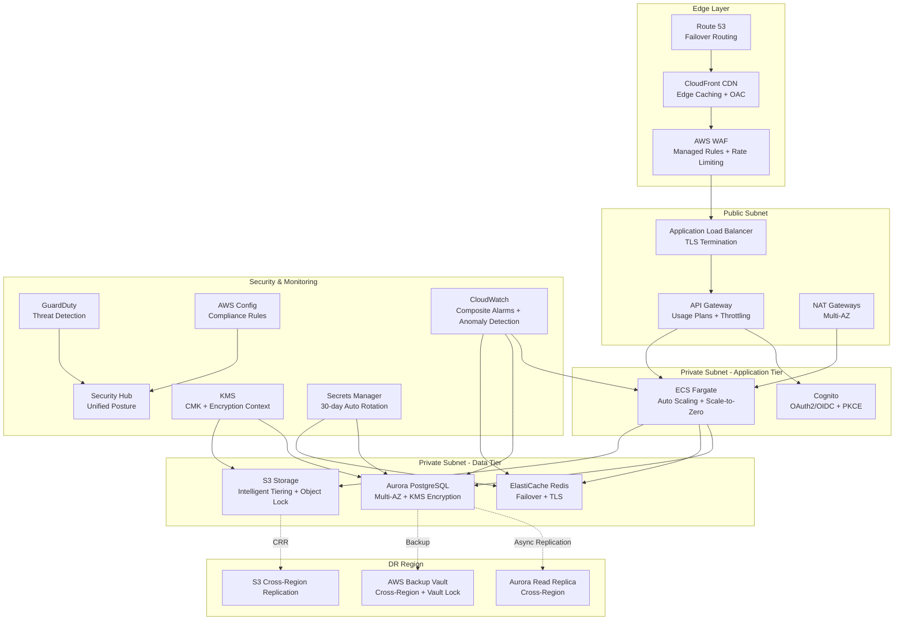
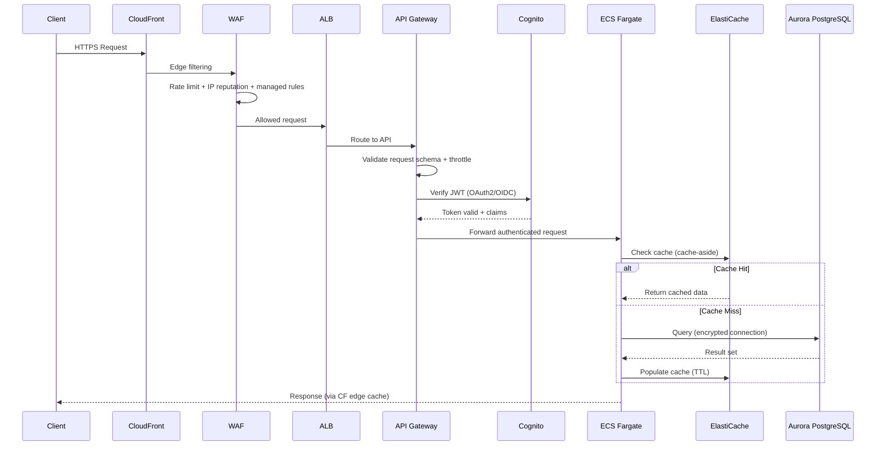

# 🔒 Secure Multi-Tier Platform

> Solutions Architect | VPC · WAF · Cognito · Aurora · ECS Fargate · GuardDuty · DR

- **Enterprise Multi-Tier Architecture:** Layered VPC design with public/private subnets, NAT gateways, NACLs, and flow logs across availability zones
- **Defence in Depth:** WAF managed rules, security groups with least-privilege, GuardDuty threat detection, Security Hub unified posture
- **Managed Authentication:** Cognito OAuth2/OIDC with PKCE, role-based access control, and API Gateway request validation with usage plans
- **Data Tier Resilience:** Aurora PostgreSQL Multi-AZ with KMS encryption, Performance Insights, and cross-region replica for DR (RPO 1h / RTO 4h)
- **Caching & Performance:** ElastiCache Redis with automatic failover, TLS in-transit encryption, and cache-aside pattern
- **Zero-Cost Model:** Full platform runs locally with Docker Compose + LocalStack; on-demand AWS demo costs < £5 for 2-hour session
- **Property-Based Testing:** Hypothesis tests verifying 10 correctness invariants across infrastructure and application logic
- **Comprehensive IaC:** 22 Terraform modules composed through a root module with CI/CD via GitHub Actions and OIDC federation

[-brightgreen)](https://github.com/Steven-Owen-21/secure-multi-tier-platform/actions)
[](https://github.com/Steven-Owen-21/secure-multi-tier-platform)
[](https://github.com/Steven-Owen-21/secure-multi-tier-platform)
[-green)](https://github.com/Steven-Owen-21/secure-multi-tier-platform)
[](https://opensource.org/licenses/MIT)

---

## 🎯 What This Project Demonstrates

| Skill Area | Components |
|:-----------|:-----------|
| 🌐 VPC Networking | Public/private subnets, NAT gateways, NACLs, VPC flow logs, multi-AZ |
| 🛡️ Security Groups | Layered rules, least-privilege, inter-tier isolation |
| 🗄️ RDS Aurora PostgreSQL | Multi-AZ cluster, KMS encryption, Performance Insights, automated backups |
| ⚡ ElastiCache Redis | Automatic failover, TLS, auth tokens, cache-aside pattern |
| 🔑 Cognito Authentication | OAuth2/OIDC, PKCE flow, role-based access, user pool + identity pool |
| 🚪 API Gateway | Usage plans, throttling, request validation, WAF integration |
| 🔥 WAF & DDoS Protection | Managed rules, rate limiting, IP reputation lists, geo-restrictions |
| 🕵️ Security Monitoring | GuardDuty, AWS Config, Security Hub, unified findings |
| 🌍 Disaster Recovery | Cross-region Aurora replica, Route 53 failover, RPO 1h / RTO 4h |
| 🌐 CloudFront CDN | Edge caching, OAC for S3, geo-restrictions, custom error responses |
| 📦 ECS Fargate | Auto scaling (target tracking + step), scale-to-zero, task definitions |
| 🔐 IAM Advanced | Permission boundaries, role chaining, session policies, Access Analyzer |
| 🔄 Secrets Manager | 30-day automatic rotation, single-user strategy, cross-service references |
| 🔑 KMS Governance | CMK management, grants, encryption context, annual rotation |
| 📊 CloudWatch Observability | Composite alarms, anomaly detection, dashboards, Contributor Insights |
| 🗂️ S3 Lifecycle | Intelligent Tiering, Glacier archival, Object Lock |
| 💾 AWS Backup | Cross-region vaults, vault lock, tag-based selection |
| 📈 Service Quotas | 80% threshold alarms, Trusted Advisor integration |
| 🏷️ Resource Tagging | 6 mandatory tags, cost allocation, Config compliance rules |
| 🏗️ Infrastructure as Code | 22 Terraform modules, root composition, remote state, CI/CD |
| 🧪 Testing | 267 tests — unit (Pytest) + property-based (Hypothesis, 10 invariants) |
| 📝 Documentation | 7 ADRs, runbooks, architecture diagrams, cost analysis, Well-Architected review |

---

## 🏗️ System Architecture



---

## 🔄 Request Flow



---

## 📊 Test Coverage

| Component | Unit | Property | Coverage |
|:----------|:-----|:---------|:---------|
| VPC Networking | ✅ | Subnet CIDR non-overlap | 85%+ |
| Security Groups | ✅ | Least-privilege rule validation | 90%+ |
| Aurora PostgreSQL | ✅ | Encryption config correctness | 85%+ |
| ElastiCache Redis | ✅ | Failover configuration | 85%+ |
| Cognito Auth | ✅ | Token validation properties | 90%+ |
| API Gateway | ✅ | Request validation rules | 85%+ |
| WAF Rules | ✅ | Rate limiting behaviour | 85%+ |
| ECS Scaling | ✅ | Scaling policy thresholds | 85%+ |
| IAM Policies | ✅ | Permission boundary constraints | 90%+ |
| KMS/Secrets | ✅ | Rotation and encryption config | 90%+ |

**Property Invariants (Hypothesis, 50+ examples each):**
1. VPC subnet CIDRs never overlap and fit within the VPC CIDR block
2. Security group rules always deny cross-tier traffic not explicitly allowed
3. Aurora encryption configuration is always enabled with valid KMS key ARN
4. ElastiCache auth tokens meet minimum entropy requirements
5. Cognito JWT claims always contain required fields after token exchange
6. API Gateway throttle limits are always within configured usage plan bounds
7. WAF rate-limiting counters reset correctly after the evaluation window
8. ECS task scaling never exceeds maximum capacity under any input load
9. IAM permission boundaries always restrict actions to the declared service scope
10. KMS encryption context values are always non-empty and deterministically derivable

---

## 🚀 Quick Start

### Prerequisites

- [Python](https://www.python.org/) 3.11+
- [Docker](https://docs.docker.com/get-docker/) & Docker Compose v2+
- [Terraform](https://www.terraform.io/downloads) v1.5+
- [AWS CLI](https://aws.amazon.com/cli/) v2 (for demo deployments only)

### Local Development

```bash
# Clone
git clone https://github.com/Steven-Owen-21/secure-multi-tier-platform.git
cd secure-multi-tier-platform

# Install dependencies
make setup

# Start LocalStack and supporting services
docker compose up -d

# Provision infrastructure locally
make deploy-local

# Verify
curl http://localhost:4566/_localstack/health
```

### Running Tests

```bash
# Unit tests
make test-unit

# Property-based tests (Hypothesis, 50 examples)
make test-property

# All tests (267 total)
make test

# Lint and format
make lint
make format
```

### Demo Deployment (Real AWS)

```bash
# One-command deploy via GitHub Actions (OIDC federation — no long-lived keys)
gh workflow run demo.yml

# Deploys in ~15 mins → outputs API Gateway URL → auto-teardown after demo
```

---

## 💰 Cost Model

| Scenario | Cost | Notes |
|:---------|:-----|:------|
| Local development | **£0** | Docker + LocalStack |
| CI pipeline runs | **£0** | GitHub Actions free (public repo) |
| Single demo (2 hours) | **< £5** | Fargate + Aurora + ElastiCache + WAF + CloudFront |
| Monthly ongoing | **£0** | No always-on infrastructure; scale-to-zero |

ECS Fargate scales to zero outside demo windows. Aurora Serverless v2 pauses at 0 ACU. Cost safety alert at 4 hours prevents forgotten infrastructure.

---

## 📁 Project Structure

```
secure-multi-tier-platform/
├── .github/workflows/
│   ├── ci.yml                  # PR: lint → test → security-scan → plan
│   ├── cd.yml                  # Deploy: build → staging → teardown
│   └── demo.yml                # One-command demo deploy & teardown (OIDC)
├── src/
│   ├── api/                    # FastAPI application (routes, middleware, schemas)
│   ├── auth/                   # Cognito integration (token validation, RBAC)
│   ├── cache/                  # Redis cache-aside pattern implementation
│   ├── db/                     # SQLAlchemy models, migrations, repositories
│   ├── models/                 # Pydantic domain models and validators
│   └── config/                 # Environment-specific configuration
├── infrastructure/
│   ├── modules/
│   │   ├── vpc/                # VPC, subnets, NAT, NACLs, flow logs
│   │   ├── security-groups/    # Layered SG rules, inter-tier isolation
│   │   ├── rds-aurora/         # Multi-AZ cluster, KMS, Performance Insights
│   │   ├── elasticache/        # Redis cluster, failover, TLS, auth
│   │   ├── cognito/            # User pool, identity pool, OAuth2/OIDC
│   │   ├── api-gateway/        # REST API, usage plans, throttling
│   │   ├── waf/                # Managed rules, rate limiting, IP reputation
│   │   ├── guardduty/          # Threat detection, findings export
│   │   ├── security-hub/       # Unified security posture, standards
│   │   ├── config-rules/       # AWS Config compliance rules
│   │   ├── cloudfront/         # CDN, OAC, geo-restrictions
│   │   ├── ecs-fargate/        # Cluster, services, task defs, auto scaling
│   │   ├── iam-advanced/       # Permission boundaries, Access Analyzer
│   │   ├── secrets-manager/    # Rotation config, cross-service references
│   │   ├── kms/                # CMK, grants, encryption context, rotation
│   │   ├── cloudwatch/         # Composite alarms, anomaly detection, dashboards
│   │   ├── s3-lifecycle/       # Intelligent Tiering, Glacier, Object Lock
│   │   ├── backup/             # Cross-region vaults, vault lock, tag selection
│   │   ├── service-quotas/     # Threshold alarms, Trusted Advisor
│   │   ├── tagging/            # Mandatory tags, cost allocation, compliance
│   │   ├── route53/            # Hosted zones, failover routing, health checks
│   │   └── dr/                 # Cross-region replica, recovery automation
│   ├── root/                   # Root module composing all 22 modules
│   └── environments/           # dev.tfvars, demo.tfvars
├── tests/
│   ├── unit/                   # Pytest unit tests
│   ├── property/               # Hypothesis property-based tests (10 invariants)
│   └── integration/            # End-to-end tests against LocalStack
├── docs/
│   ├── architecture/           # Architecture diagrams (Mermaid)
│   ├── adr/                    # 7 Architecture Decision Records
│   ├── well-architected/       # All 6 pillars review
│   ├── runbooks/               # Security runbooks, DR runbooks, DR testing
│   ├── cost-analysis.md        # Cost breakdown and optimisation
│   ├── skills-matrix.md        # Skills demonstrated per component
│   └── security-posture.md     # Security posture summary
├── docker-compose.yml          # LocalStack + Redis + PostgreSQL
├── Makefile                    # Developer workflow targets
├── pyproject.toml              # Python config (FastAPI, SQLAlchemy, Pydantic, Hypothesis)
├── requirements.txt            # Production dependencies
└── requirements-dev.txt        # Dev/test dependencies
```

---

## 🛡️ Technology Stack

| Category | Technology | Purpose |
|:---------|:-----------|:--------|
| Language | Python 3.11+ | FastAPI application, infrastructure tests |
| Framework | FastAPI | Async REST API with automatic OpenAPI docs |
| ORM | SQLAlchemy 2.0 | Database models, migrations, async sessions |
| Validation | Pydantic v2 | Request/response schemas, settings management |
| IaC | Terraform | 22 modules composing enterprise multi-tier infra |
| Networking | Amazon VPC | Subnets, NAT, NACLs, flow logs, multi-AZ |
| Compute | ECS Fargate | Serverless containers with auto scaling |
| Database | Aurora PostgreSQL | Multi-AZ, encrypted, Performance Insights |
| Caching | ElastiCache Redis | In-memory cache with failover and TLS |
| Auth | Amazon Cognito | OAuth2/OIDC, PKCE, role-based access |
| API | API Gateway | Usage plans, throttling, request validation |
| CDN | CloudFront | Edge caching, geo-restrictions, OAC |
| Security | WAF, GuardDuty, Security Hub | Layered threat protection and posture management |
| Encryption | KMS + Secrets Manager | CMK governance, automatic secret rotation |
| Observability | CloudWatch | Composite alarms, anomaly detection, dashboards |
| DR | Route 53 + Aurora Replica | Cross-region failover, RPO 1h / RTO 4h |
| Backup | AWS Backup | Cross-region vaults, vault lock, tag-based |
| Local Dev | Docker Compose + LocalStack | Full AWS emulation at £0 |
| CI/CD | GitHub Actions | OIDC federation, lint, test, security scan, deploy |
| Testing | Pytest + Hypothesis | 267 tests — unit + property-based (10 invariants) |
| Linting | Black, Ruff, mypy | Code formatting, linting, type checking |
| Security Scan | Checkov, tfsec | Terraform and container security scanning |

---

## 📚 Documentation

| Document | Description |
|:---------|:-----------|
| [ADR-001](docs/adr/001-vpc-topology.md) | VPC topology: multi-AZ with isolated data subnets |
| [ADR-002](docs/adr/002-aurora-over-rds.md) | Aurora PostgreSQL selection over standard RDS |
| [ADR-003](docs/adr/003-cognito-auth.md) | Cognito for managed auth over custom JWT implementation |
| [ADR-004](docs/adr/004-ecs-fargate-over-ec2.md) | ECS Fargate selection over EC2 for compute tier |
| [ADR-005](docs/adr/005-waf-strategy.md) | WAF managed rules over custom rule authoring |
| [ADR-006](docs/adr/006-dr-strategy.md) | Warm standby DR with cross-region Aurora replica |
| [ADR-007](docs/adr/007-cicd-oidc.md) | GitHub Actions OIDC federation over IAM access keys |
| [Architecture Overview](docs/architecture/overview.md) | Multi-tier architecture with Mermaid diagrams |
| [Security Posture](docs/security-posture.md) | Defence-in-depth layers and compliance mapping |
| [DR Runbook](docs/runbooks/dr-runbook.md) | Disaster recovery procedures and testing |
| [Security Runbook](docs/runbooks/security-runbook.md) | Incident response and remediation procedures |
| [Cost Analysis](docs/cost-analysis.md) | Demo vs production cost breakdown |
| [Skills Matrix](docs/skills-matrix.md) | AWS services and skills demonstrated |
| [Well-Architected Review](docs/well-architected/review.md) | All 6 pillars assessment |

---

## 📄 License

MIT
