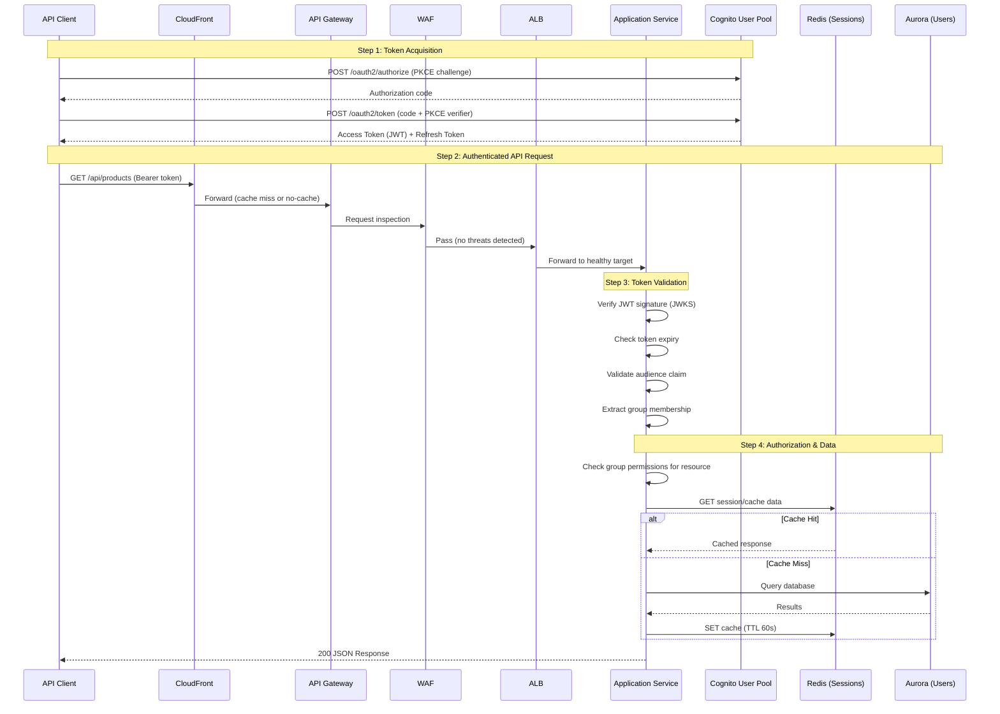
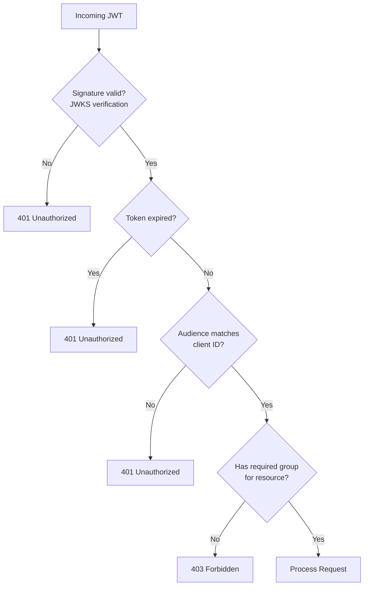
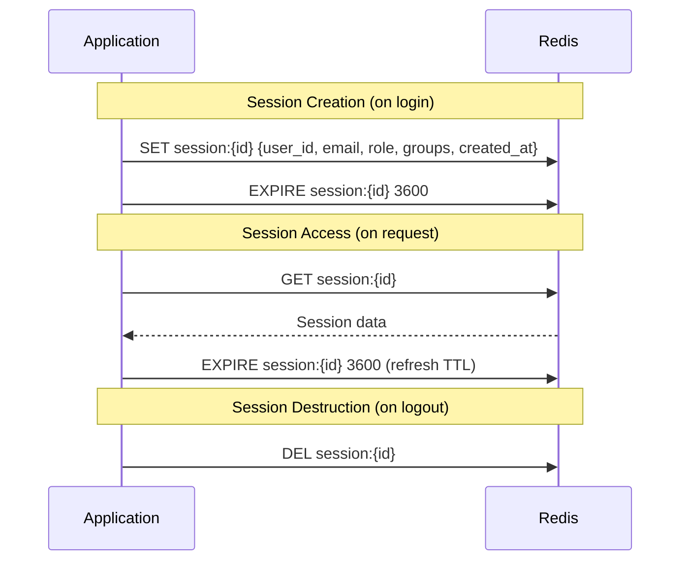

# Authentication Architecture

## Overview

Authentication uses Amazon Cognito as the OAuth2/OIDC identity provider with Authorization Code flow + PKCE. The Application Service validates JWTs on every request, checking signature, expiry, audience, and group membership for role-based access control.

## Authentication Flow



## Cognito Configuration

### User Pool Settings

| Setting | Value | Rationale |
|---------|-------|-----------|
| Sign-up | Email-based | Standard SaaS pattern |
| Email verification | Required | Prevent fake accounts |
| MFA | Optional (TOTP) | Available for admin users |
| Password policy | Min 12 chars, upper + lower + number + symbol | Enterprise standard |
| Token validity (access) | 1 hour | Limits exposure window |
| Token validity (refresh) | 30 days | Good UX for returning users |

### OAuth2 Client Configuration

| Parameter | Value |
|-----------|-------|
| Flow | Authorization Code with PKCE |
| Scopes | openid, email, profile |
| Callback URLs | Configurable per environment |
| Logout URLs | Configurable per environment |

### User Pool Groups (RBAC)

| Group | Permissions | Use Case |
|-------|------------|----------|
| admin | Full CRUD on all resources | Platform administrators |
| manager | Read all + write products/orders | Operational managers |
| viewer | Read-only access | Report consumers, auditors |

## JWT Token Structure

### Access Token Claims

```json
{
  "sub": "user-uuid",
  "iss": "https://cognito-idp.eu-west-2.amazonaws.com/eu-west-2_xxxxx",
  "aud": "client-id",
  "token_use": "access",
  "scope": "openid email profile",
  "cognito:groups": ["manager"],
  "exp": 1705334400,
  "iat": 1705330800
}
```

### Validation Checks



### Validation Steps (in order)

1. **Signature verification**: Validate against Cognito JWKS endpoint (public keys cached locally)
2. **Expiry check**: `exp` claim must be in the future
3. **Audience check**: `aud` must match the configured Cognito client ID
4. **Group membership**: `cognito:groups` must include a group with permission for the requested resource/action

## Authorization Matrix

| Resource | Action | admin | manager | viewer |
|----------|--------|-------|---------|--------|
| Products | Read | ✅ | ✅ | ✅ |
| Products | Create/Update | ✅ | ✅ | ❌ |
| Products | Delete | ✅ | ❌ | ❌ |
| Orders | Read (own) | ✅ | ✅ | ✅ |
| Orders | Read (all) | ✅ | ✅ | ❌ |
| Orders | Create | ✅ | ✅ | ❌ |
| Users | Read | ✅ | ❌ | ❌ |
| Users | Manage | ✅ | ❌ | ❌ |

## Session Management

### Session Flow



### Session Data Structure

```json
{
  "user_id": "uuid-string",
  "email": "user@example.com",
  "role": "manager",
  "groups": ["manager"],
  "created_at": 1705330800.0,
  "last_accessed": 1705334400.0,
  "metadata": {}
}
```

## Error Responses

### 401 Unauthorized

```json
{
  "error": "unauthorized",
  "message": "Token validation failed: [reason]",
  "request_id": "req-abc123"
}
```

### 403 Forbidden

```json
{
  "error": "forbidden",
  "message": "Insufficient permissions for this resource",
  "request_id": "req-abc123"
}
```

## JWKS Caching

- Public keys cached locally in the application
- Cache TTL: 24 hours (keys rotate infrequently)
- Cache refresh: On signature verification failure, refresh keys once before rejecting
- Prevents repeated network calls to Cognito JWKS endpoint
