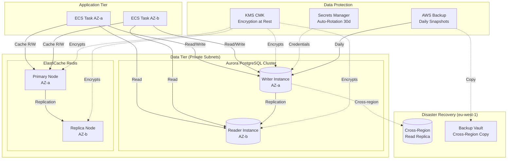
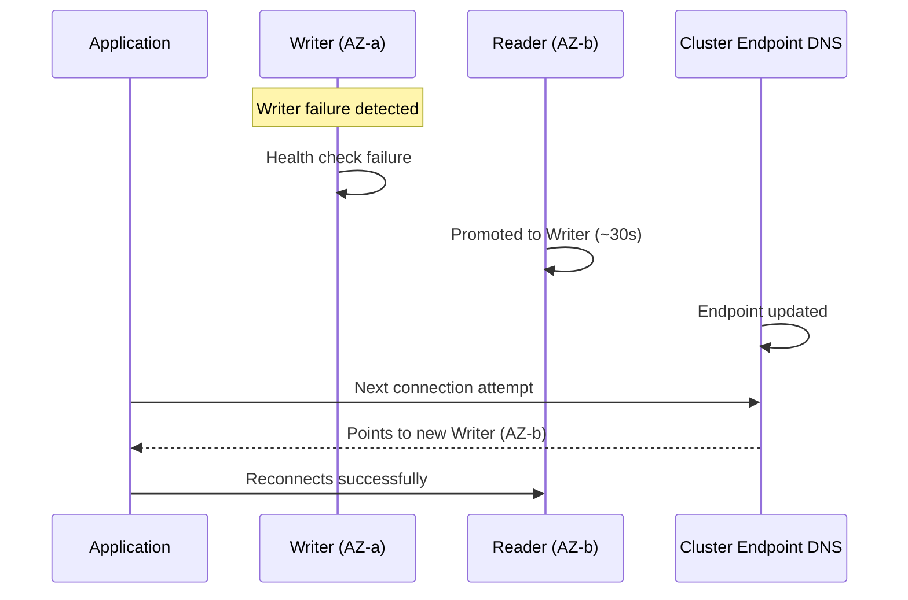
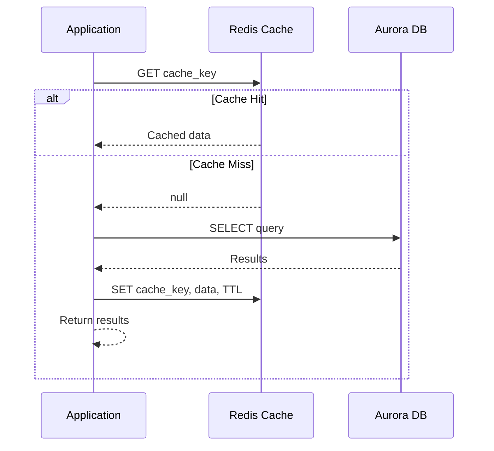
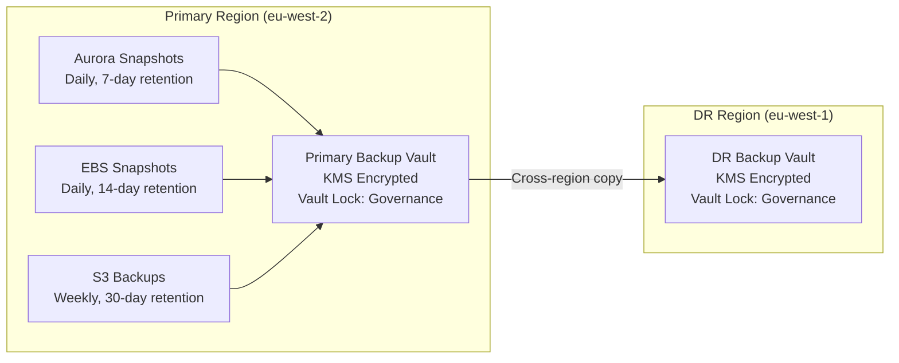
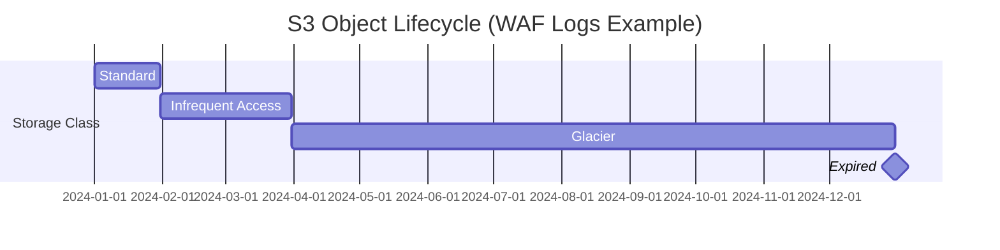

# Data Tier Architecture

## Overview

The data tier provides persistent storage (Aurora PostgreSQL), caching (ElastiCache Redis), and backup protection (AWS Backup). All components are deployed in private subnets with no public accessibility, encrypted with a shared KMS CMK, and replicated across Availability Zones.



## Aurora PostgreSQL

### Cluster Configuration

| Parameter | Value | Rationale |
|-----------|-------|-----------|
| Engine | Aurora PostgreSQL 15.x | Latest LTS, Multi-AZ native |
| Instance class | Configurable (default: db.t3.medium) | Cost-appropriate for demos |
| Writer instances | 1 | Single writer endpoint |
| Reader instances | 1 (minimum) | HA + read offload |
| Multi-AZ | Yes (writer and reader in different AZs) | Automatic failover |
| Storage encryption | KMS CMK | Compliance requirement |
| IAM authentication | Enabled | Token-based access from ECS |
| Performance Insights | 7-day retention | Query performance analysis |

### Parameter Group

| Parameter | Value | Purpose |
|-----------|-------|---------|
| max_connections | Calculated per instance class | Connection pooling headroom |
| log_statement | ddl | Log schema changes |
| log_min_duration_statement | 1000 (ms) | Slow query logging |
| shared_buffers | 25% of instance memory | Query cache efficiency |
| work_mem | 4MB | Sort/hash operation memory |

### Backup Configuration

| Setting | Value |
|---------|-------|
| Automated backups | Enabled |
| Retention period | 7 days |
| Backup window | 03:00-04:00 UTC (outside business hours) |
| Cross-region replica | eu-west-1 |
| Point-in-time recovery | Continuous (5-minute granularity) |

### Failover Behaviour



### Connection Architecture

- **Cluster endpoint** (writer): `cluster-name.cluster-xxxxx.eu-west-2.rds.amazonaws.com`
- **Reader endpoint**: `cluster-name.cluster-ro-xxxxx.eu-west-2.rds.amazonaws.com`
- **Application connection pool**: Size 10, max overflow 20, SSL enforced
- **IAM database auth**: Token-based (15-minute token validity)

## ElastiCache Redis

### Replication Group Configuration

| Parameter | Value | Rationale |
|-----------|-------|-----------|
| Engine | Redis 7.x | Latest stable, cluster-mode available |
| Node type | Configurable (default: cache.t3.micro) | Cost-appropriate for demos |
| Primary nodes | 1 | Single primary |
| Replica nodes | 1 | HA failover target |
| Multi-AZ failover | Automatic | Zero-intervention recovery |
| Encryption at rest | KMS CMK | Data protection |
| Encryption in transit | TLS | Network security |
| AUTH token | Stored in Secrets Manager | Rotated every 30 days |

### Parameter Group

| Parameter | Value | Purpose |
|-----------|-------|---------|
| maxmemory-policy | allkeys-lru | Evict least recently used when full |
| timeout | 300 seconds | Close idle connections |
| notify-keyspace-events | Ex | Enable keyspace notifications for expiry |

### Caching Patterns

#### Cache-Aside Pattern



#### Cache Key Schema

```
cache:products:list:{hash(sort_by, category, page, page_size)}
cache:products:detail:{product_id}
cache:orders:user:{user_id}:{hash(status, page)}
session:{session_id}
```

#### Cache Invalidation

- **Write-through**: On data mutation, invalidate related cache keys
- **Pattern-based**: `SCAN` for matching keys on bulk operations
- **TTL-based**: Default 60s for query results, 3600s for sessions
- **Graceful degradation**: On Redis failure, bypass cache and query Aurora directly

### Failover Behaviour

- Automatic failover to replica on primary failure
- Application uses primary endpoint (DNS updated on failover)
- Connection retry: 3 attempts with exponential backoff
- Degraded mode: App continues serving from Aurora if Redis unavailable

## AWS Backup

### Backup Architecture



### Backup Plan Rules

| Resource Type | Schedule | Retention | Cross-Region |
|--------------|----------|-----------|-------------|
| Aurora | Daily (cron 0 3 * * ? *) | 7 days | Yes |
| EBS Volumes | Daily (cron 0 4 * * ? *) | 14 days | Yes |
| S3 Buckets | Weekly (cron 0 5 ? * SUN *) | 30 days | Yes |

### Resource Selection

- **Method**: Tag-based selection (`BackupEnabled=true`)
- **Benefit**: New resources automatically included when tagged
- **Governance**: Vault lock in governance mode prevents deletion during retention period

### Vault Security

- Both vaults encrypted with KMS CMK
- Vault lock (governance mode) prevents backup deletion
- IAM role with minimum permissions: create, copy, restore
- Cross-region copy uses separate KMS key in DR region

## S3 Storage Lifecycle

### Bucket Configuration

| Bucket | Lifecycle Transitions | Versioning | Object Lock |
|--------|----------------------|-----------|-------------|
| WAF Logs | Standard → IA (30d) → Glacier (90d) → Expire (365d) | Yes | No |
| VPC Flow Logs | Expire (90d) | No | No |
| Application Data | Intelligent Tiering (auto) → Archive (90d no-access) | Yes | No |
| Audit Logs | Standard → IA (30d) → Glacier (90d) → Expire (365d) | Yes | Governance mode |

### Lifecycle Transition Timeline



### Common Settings (All Buckets)

- Server-side encryption: KMS CMK
- Block public access: Enabled (all four settings)
- Non-current version expiry: 30 days (where versioning enabled)
- Access logging: Enabled to centralised log bucket
