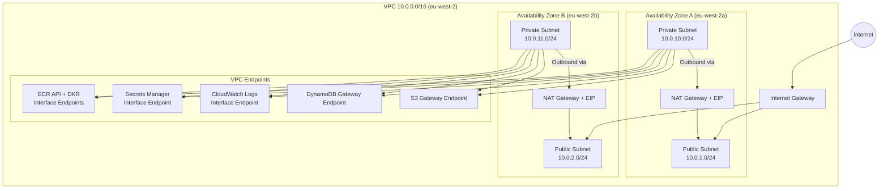
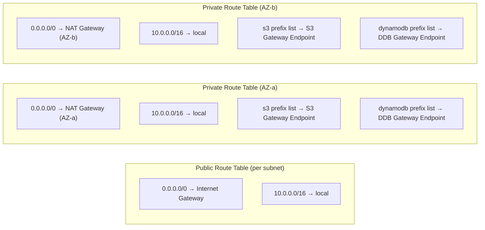
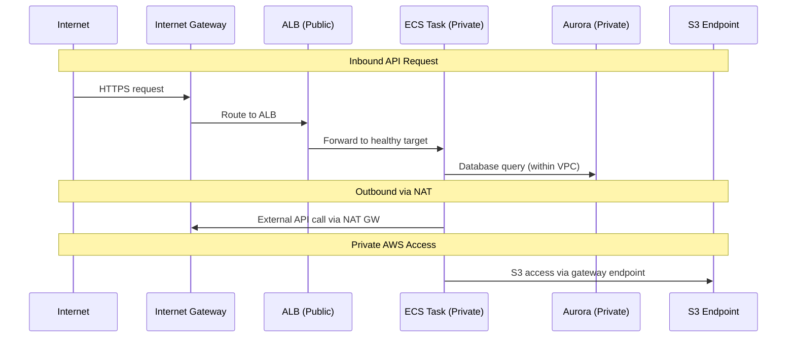

# Network Architecture

## VPC Topology

The platform deploys within a single VPC (`10.0.0.0/16`) in eu-west-2 with public and private subnets across two Availability Zones. Network isolation is enforced through subnet placement, route tables, NACLs, and security groups.

### VPC Layout

### Subnet Allocation

| Subnet | CIDR | AZ | Purpose | Resources |
|--------|------|-----|---------|-----------|
| Public A | 10.0.1.0/24 | eu-west-2a | Internet-facing | ALB, NAT Gateway |
| Public B | 10.0.2.0/24 | eu-west-2b | Internet-facing | ALB, NAT Gateway |
| Private A | 10.0.10.0/24 | eu-west-2a | Application + Data | ECS tasks, Aurora, Redis |
| Private B | 10.0.11.0/24 | eu-west-2b | Application + Data | ECS tasks, Aurora, Redis |

### Route Tables

### Network Access Control Lists (NACLs)

#### Public Subnet NACLs

| Rule # | Direction | Protocol | Port Range | Source/Dest | Action |
|--------|-----------|----------|------------|-------------|--------|
| 100 | Inbound | TCP | 443 | 0.0.0.0/0 | ALLOW |
| 110 | Inbound | TCP | 1024-65535 | 0.0.0.0/0 | ALLOW |
| * | Inbound | All | All | 0.0.0.0/0 | DENY |
| 100 | Outbound | TCP | All | 0.0.0.0/0 | ALLOW |
| * | Outbound | All | All | 0.0.0.0/0 | DENY |

#### Private Subnet NACLs

| Rule # | Direction | Protocol | Port Range | Source/Dest | Action |
|--------|-----------|----------|------------|-------------|--------|
| 100 | Inbound | All | All | 10.0.0.0/16 | ALLOW |
| * | Inbound | All | All | 0.0.0.0/0 | DENY |
| 100 | Outbound | All | All | 10.0.0.0/16 | ALLOW |
| 110 | Outbound | TCP | 443 | 0.0.0.0/0 | ALLOW |
| * | Outbound | All | All | 0.0.0.0/0 | DENY |

### VPC Endpoints

Private connectivity to AWS services without traversing the public internet:

| Endpoint | Type | Purpose | Cost Benefit |
|----------|------|---------|-------------|
| S3 | Gateway | Bucket access (logs, assets, backups) | Free, no NAT charges |
| DynamoDB | Gateway | Terraform state locking | Free, no NAT charges |
| CloudWatch Logs | Interface | Log delivery from ECS tasks | Reduced NAT traffic |
| Secrets Manager | Interface | Credential retrieval | Reduced NAT traffic |
| ECR API | Interface | Container image pulls | Reduced NAT traffic |
| ECR DKR | Interface | Docker layer downloads | Reduced NAT traffic |

### VPC Flow Logs

- **Capture**: All traffic (ACCEPT and REJECT)
- **Destination**: CloudWatch Logs group
- **Retention**: 30 days
- **Purpose**: Network forensics, troubleshooting, compliance auditing

### DNS Configuration

- `enableDnsHostnames`: true (required for VPC endpoints)
- `enableDnsSupport`: true (required for Route 53 private hosted zones)
- Interface endpoints use private DNS for seamless service access

### Traffic Flow Patterns

