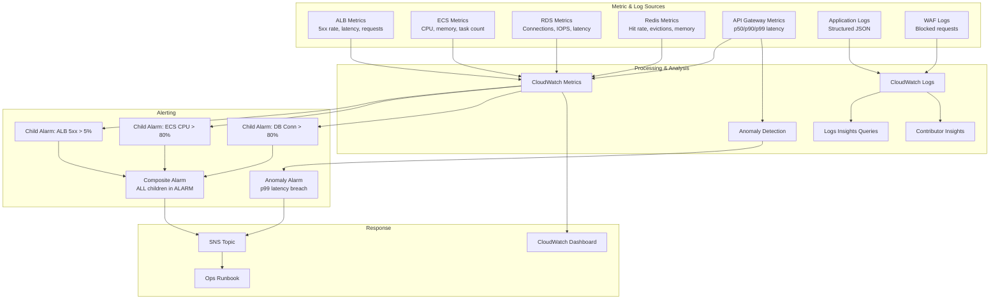
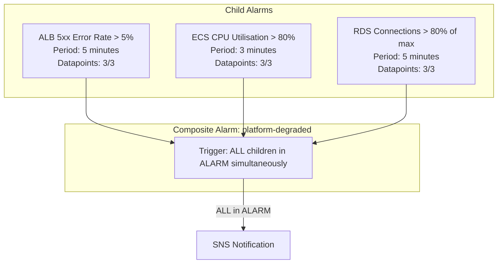
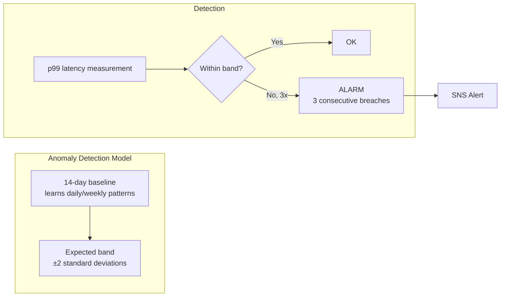
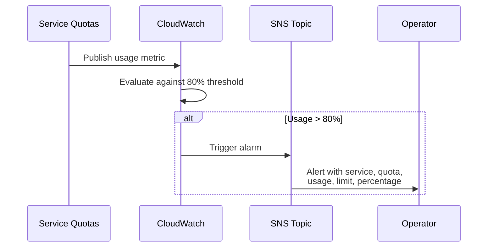

# Observability Architecture

## Overview

The observability layer provides operational insight through structured logging, composite alarms, anomaly detection, dashboards, and Contributor Insights. The goal is actionable alerts with reduced noise — composite alarms trigger only when multiple indicators confirm a problem.



## Composite Alarm Structure

The composite alarm reduces alert fatigue by triggering only when multiple indicators confirm a genuine platform degradation.



### Alarm State Evaluation

| Child 1 (5xx) | Child 2 (CPU) | Child 3 (DB) | Composite State |
|---------------|---------------|--------------|-----------------|
| OK | OK | OK | OK |
| ALARM | OK | OK | OK |
| ALARM | ALARM | OK | OK |
| ALARM | ALARM | ALARM | **ALARM** |
| INSUFFICIENT_DATA | ALARM | ALARM | OK |

**Rationale**: A single metric spike (e.g. brief CPU spike during deployment) should not page an operator. Only when errors, CPU pressure, and database saturation align does it indicate genuine platform distress.

## Anomaly Detection

### Configuration

| Parameter | Value |
|-----------|-------|
| Metric | API Gateway p99 latency |
| Training period | 14 days (auto-learns patterns) |
| Band width | 2 standard deviations |
| Alarm trigger | 3 consecutive datapoints outside upper band |
| Benefit | Detects latency degradation without static thresholds |



## CloudWatch Dashboard

### Widget Layout

```
┌─────────────────────────────────┬─────────────────────────────────┐
│ API Latency (p50 / p90 / p99)   │ Error Rates (4xx / 5xx)         │
│ Line graph, 5-min period        │ Stacked area, 5-min period      │
├─────────────────────────────────┼─────────────────────────────────┤
│ Cache Hit Ratio                 │ DB Active Connections           │
│ Single metric, percentage       │ Line graph with max_conn line   │
├─────────────────────────────────┼─────────────────────────────────┤
│ ECS Running Tasks               │ Cumulative Cost Estimate        │
│ Number widget with min/max ref  │ Number widget, current session  │
└─────────────────────────────────┴─────────────────────────────────┘
```

### Dashboard Widgets Detail

| Widget | Metric Source | Period | Statistic |
|--------|--------------|--------|-----------|
| API Latency | API Gateway | 5 min | p50, p90, p99 |
| Error Rates | ALB | 5 min | Sum (4xx, 5xx) |
| Cache Hit Ratio | Application custom metric | 1 min | Average |
| DB Connections | RDS | 5 min | Average |
| ECS Tasks | ECS | 1 min | Average (RunningTaskCount) |
| Cost Estimate | Billing | 6 hours | Maximum |

## CloudWatch Logs Insights

### Saved Queries

**Slow Requests (> 1 second)**:
```
fields @timestamp, method, path, duration_ms, user_id
| filter duration_ms > 1000
| sort duration_ms desc
| limit 50
```

**Authentication Failures by Source IP**:
```
fields @timestamp, source_ip, path, status_code
| filter status_code = 401
| stats count() as failures by source_ip
| sort failures desc
| limit 20
```

**Cache Misses by Endpoint**:
```
fields @timestamp, path, cache_hit
| filter cache_hit = false
| stats count() as misses by path
| sort misses desc
| limit 20
```

## Contributor Insights

### Rules

| Rule | Group By | Metric | Purpose |
|------|----------|--------|---------|
| Top Callers | API Key ID | Request Count | Identify heavy API consumers |
| Top Errors | Endpoint + Status Code | Error Count | Pinpoint problematic endpoints |

### Top Callers Rule

- **Log group**: API Gateway access logs
- **Contribution**: Grouped by `api_key_id`
- **Metric**: Count of requests per contributor
- **Display**: Top 10 contributors over selected time range

### Top Error Sources Rule

- **Log group**: API Gateway access logs
- **Contribution**: Grouped by `path` + `status_code`
- **Filter**: `status_code >= 400`
- **Display**: Top 10 error-producing endpoint/status combinations

## Structured Logging Format

All application logs are emitted as structured JSON:

```json
{
  "timestamp": "2024-01-15T14:30:00.123Z",
  "level": "INFO",
  "request_id": "req-abc123",
  "method": "GET",
  "path": "/api/products",
  "status_code": 200,
  "duration_ms": 45,
  "user_id": "usr-xyz789",
  "cache_hit": true,
  "correlation_id": "cor-def456"
}
```

## Service Quotas Monitoring

### Monitored Quotas

| Service | Quota | Default Limit | Alarm Threshold (80%) |
|---------|-------|--------------|----------------------|
| VPC | Subnets per VPC | 200 | 160 |
| VPC | Security groups per interface | 5 | 4 |
| ECS | Tasks per service | 5000 | 4000 |
| RDS | Instances per cluster | 15 | 12 |
| Lambda | Concurrent executions | 1000 | 800 |

### Quota Alarm Flow


