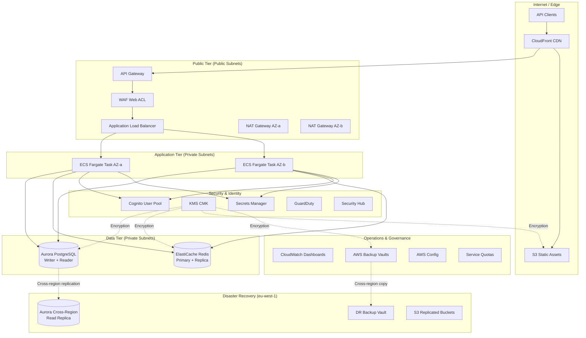
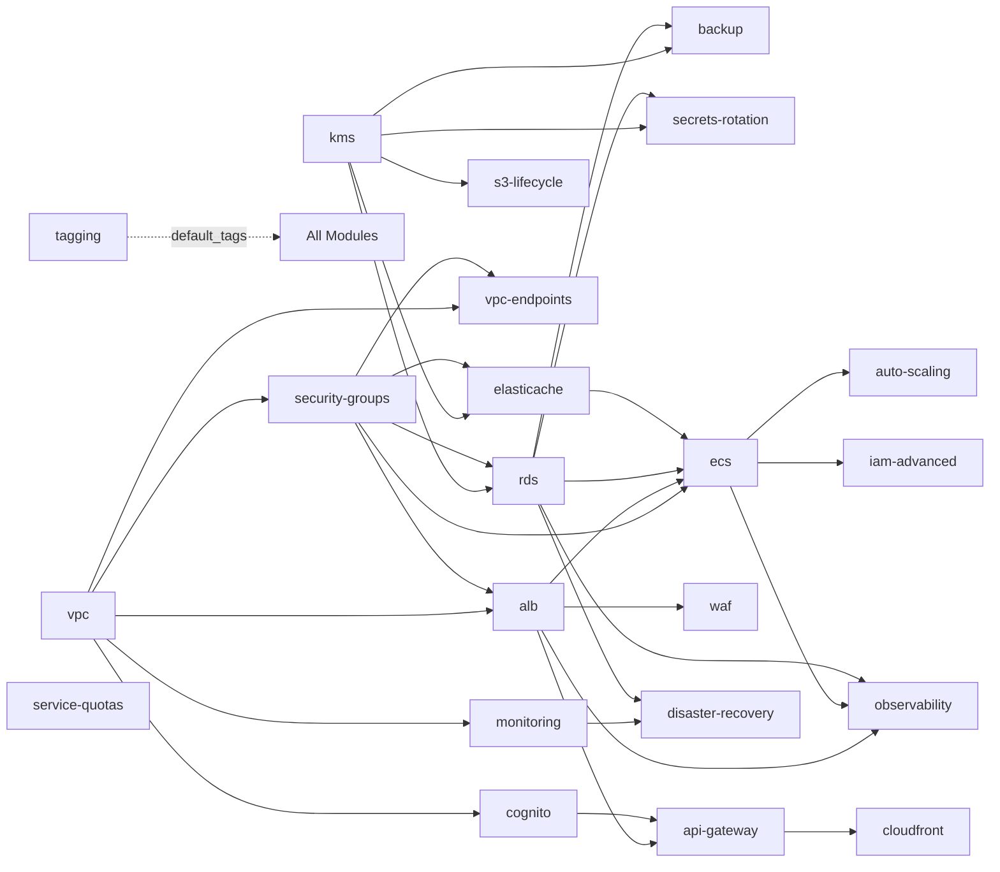

# Architecture Overview

## High-Level Architecture

The Secure Multi-Tier Platform is an enterprise-grade AWS architecture demonstrating Solutions Architect competencies across networking, security, compute, data, and operations domains. The platform implements a SaaS API backend using Python (FastAPI), provisioned with Terraform modules, and delivered through GitHub Actions CI/CD with OIDC federation.

### Design Principles

- **Defence in depth**: Multiple security layers (WAF → NACLs → Security Groups → IAM → Encryption)
- **High availability**: Multi-AZ deployment across all stateful components
- **Zero-trust networking**: Private subnets, VPC endpoints, no public database access
- **Cost safety**: Scheduled scale-to-zero, on-demand demo deployment, local-first development
- **Observability**: Composite alarms, anomaly detection, structured logging, dashboards

### Platform Tiers

### Data Flow

1. **Client → Edge**: Requests hit CloudFront, which caches API responses (60s TTL) and static assets (24h TTL)
2. **Edge → Public Tier**: API Gateway validates requests; WAF inspects for threats; ALB routes to healthy targets
3. **Public → Application**: ECS Fargate tasks process requests with JWT validation and role-based access control
4. **Application → Data**: Cache-aside pattern checks Redis first; on miss, queries Aurora and populates cache
5. **Security**: All data encrypted at rest (KMS CMK) and in transit (TLS). Secrets rotated every 30 days.
6. **Observability**: Structured JSON logs, composite alarms, anomaly detection, Contributor Insights

### Deployment Model

| Environment | Infrastructure | Cost |
|-------------|---------------|------|
| Local | Docker Compose (PostgreSQL, Redis, LocalStack) | £0 |
| Demo | Full AWS deployment (on-demand, 2hr sessions) | < £5 |
| Production (hypothetical) | Multi-AZ, auto-scaling, cross-region DR | Documented estimate |

### Region Strategy

- **Primary region**: eu-west-2 (London)
- **DR region**: eu-west-1 (Ireland)
- **RPO**: 1 hour
- **RTO**: 4 hours

### Terraform Module Dependency Graph

### Key Technology Choices

| Component | Technology | Rationale |
|-----------|-----------|-----------|
| IaC | Terraform with modules | Reusable, composable, well-understood by hiring managers |
| Compute | ECS Fargate | Serverless containers, no EC2 management, pay-per-use |
| Database | Aurora PostgreSQL 15 | Multi-AZ native, auto-failover, IAM auth |
| Cache | ElastiCache Redis 7 | Automatic failover, TLS, session + query caching |
| Auth | Cognito | Managed OAuth2/OIDC, no custom auth server |
| CDN | CloudFront | Edge caching, OAC for S3, geo-restrictions |
| CI/CD | GitHub Actions + OIDC | Free minutes on public repos, no stored credentials |
| Encryption | KMS CMK with grants | Fine-grained key policy, encryption context |
| Observability | CloudWatch composite alarms | Reduced alert noise, ML-based anomaly detection |
