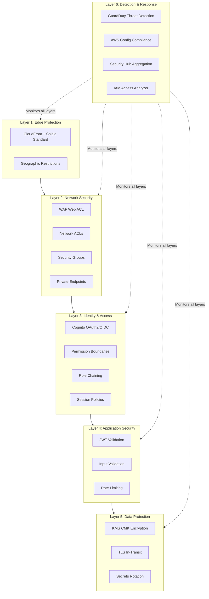
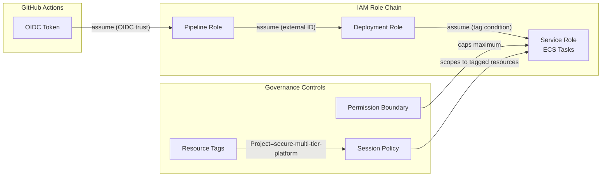
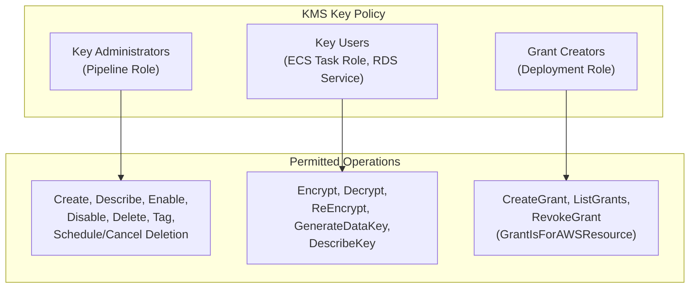
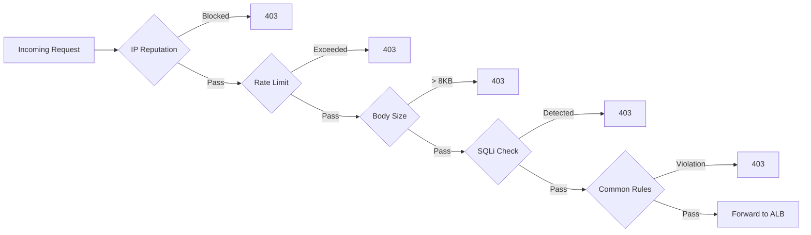
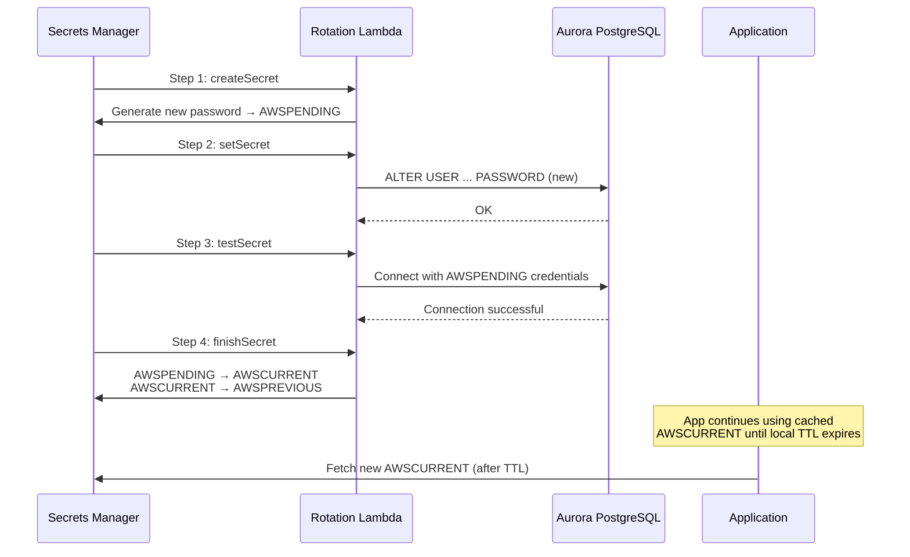
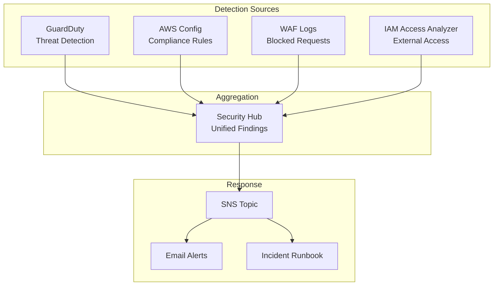

# Security Architecture

## Defence-in-Depth Strategy

The platform implements multiple overlapping security controls across network, identity, application, and data layers. No single control failure can compromise the system.



## IAM Architecture

### Role Chain Model



### Trust Policy Chain

| Role | Trusted By | Condition |
|------|-----------|-----------|
| Pipeline Role | GitHub OIDC provider | `sub` matches repo + branch |
| Deployment Role | Pipeline Role ARN | External ID required |
| Service Role | ECS service principal + Deployment Role | Tag match: `Project=secure-multi-tier-platform` |

### Permission Boundary

The permission boundary attached to application roles defines the maximum possible permissions regardless of the role's own policy:

**Allowed services** (platform services only):
- `s3:*` (scoped to platform buckets)
- `rds-db:connect` (IAM auth)
- `elasticache:*` (scoped to platform clusters)
- `secretsmanager:GetSecretValue` (platform secrets only)
- `logs:CreateLogGroup`, `logs:CreateLogStream`, `logs:PutLogEvents`
- `kms:Decrypt`, `kms:GenerateDataKey` (platform key only)
- `xray:PutTraceSegments`

**Explicitly denied** (regardless of role policy):
- All IAM actions (`iam:*`)
- All organisations actions (`organizations:*`)
- KMS key management actions
- Any service not in the allowed set

### Session Policies

Applied at assume-role time to restrict effective permissions to tagged resources:

```json
{
  "Version": "2012-10-17",
  "Statement": [{
    "Effect": "Allow",
    "Action": "*",
    "Resource": "*",
    "Condition": {
      "StringEquals": {
        "aws:ResourceTag/Project": "secure-multi-tier-platform"
      }
    }
  }]
}
```

## KMS Encryption Governance

### Key Policy Structure



### KMS Grants

| Grant | Principal | Operations | Encryption Context |
|-------|-----------|-----------|-------------------|
| Aurora | RDS service | Encrypt, Decrypt | `Project=secure-multi-tier-platform, Component=database` |
| ElastiCache | ElastiCache service | Encrypt, Decrypt | `Project=secure-multi-tier-platform, Component=cache` |
| S3 | S3 service (via bucket policy) | Encrypt, Decrypt | `Project=secure-multi-tier-platform, Component=storage` |
| Backup | AWS Backup service | CopyGrant | Cross-region backup encryption |

### Condition Keys

- `kms:EncryptionContext:Project` = `secure-multi-tier-platform` (all operations)
- `kms:ViaService` restricts usage to specific AWS services (rds, elasticache, s3, backup)
- Annual automatic key rotation enabled

## WAF Configuration

### Rule Groups

| Rule Group | Purpose | Action |
|-----------|---------|--------|
| AWSManagedRulesCommonRuleSet | OWASP Top 10 protection | Block |
| AWSManagedRulesSQLiRuleSet | SQL injection prevention | Block |
| AWSManagedRulesKnownBadInputsRuleSet | Known exploit patterns | Block |
| AWSManagedRulesAmazonIpReputationList | Known malicious IPs | Block |
| Rate-based rule | DDoS mitigation | Block (2000 req/5min/IP) |
| Body size rule | Payload attacks | Block (> 8KB) |

### WAF Processing Flow



## Secrets Rotation

### Rotation Flow (Single-User Strategy)



### Rotation Configuration

| Parameter | Value |
|-----------|-------|
| Rotation interval | 30 days |
| Strategy | Single-user |
| Credential caching TTL | 30 days (matches rotation) |
| Failure notification | SNS alert with secret ARN and failed step |
| Encryption | KMS CMK |

## Security Monitoring

### Detection Services



### AWS Config Compliance Rules

| Rule | Purpose |
|------|---------|
| encrypted-volumes | All EBS volumes use encryption |
| rds-encryption-enabled | Database encryption at rest |
| s3-bucket-server-side-encryption-enabled | S3 bucket encryption |
| vpc-flow-logs-enabled | Network traffic logging |
| iam-user-no-policies-check | No inline user policies |
| required-tags | Mandatory tag compliance |

### GuardDuty Finding Severity Actions

| Severity | Action |
|----------|--------|
| LOW | Log finding, weekly review |
| MEDIUM | SNS alert, 24-hour response target |
| HIGH | Immediate SNS alert, 4-hour response target |
| CRITICAL | Immediate SNS alert, 1-hour response target, consider resource isolation |
